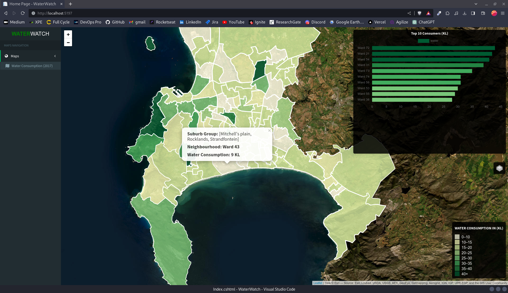

<div align="center">
<h1>WaterWatch - Water Resource Dashboard</h1>
<br>

<br>
<br>
</div>

<div align="center">
  

</div>

<div align="center">


[](https://postgis.net/)

</div>

## Database

Create the database using docker

```Shell
docker run --name gis -e POSTGRES_PASSWORD=gis -e POSTGRES_DB=gis -e POSTGRES_USER=gis -p 5432:5432 -d postgis/postgis
```

Connect to database adding the `DefaultConnection` parameters
```json
{
  "ConnectionStrings": {
    "DefaultConnection": "Host=localhost;Port=5432;Database=cptwater;Username=gis;Password=gis"
  },
  "Logging": {
    "LogLevel": {
      "Default": "Information",
      "Microsoft.AspNetCore": "Warning"
    }
  },
  "AllowedHosts": "*"
}
```
## Packages and tools
```Shell
dotnet add package Npgsql.EntityFrameworkCore.PostgreSQL
dotnet add package Newtonsoft.Json
dotnet add package Microsoft.EntityFrameworkCore.Design
dotnet tool install --global dotnet-ef
```
## Run migrations
```Shell
dotnet ef migrations add InitialMigration
dotnet ef database update
```

Developed by Fernando Pimenta [My Github!](https://github.com/pimentafm) :bird: :sunglasses: